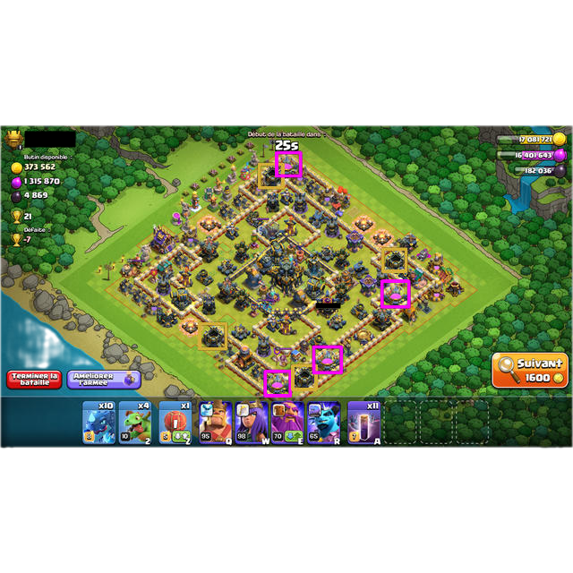

<div align="center">
    <h1>ClashVisionRuntime</h1>
    <p><em>Rust runtime for YOLOv8 model inference using ONNX Runtime on images for object detection in Clash of Clans.</em></p>
</div>
<div align="center">
  <!-- Rust -->
    

  <!-- ONNX Runtime -->
  

  <!-- Version -->
  

  <!-- License -->
  
</div>

<div align="center">
  
</div>

## 🚀 Overview

**ClashVisionRuntime** is a high-performance Rust runtime designed for executing YOLOv8 models using ONNX Runtime. It
specializes in object detection within images, making it ideal for applications such as analyzing game screenshots from
Clash of Clans.

### ✨ Key Features

- 🔍 **AI-Powered Detection**: Load and run YOLOv8 model for object detection in images.
- ⚡ **High Performance**: Optimized for speed and efficiency using Rust.
- 🖼️ **Image Processing**: Supports various image formats for input.
- 📊 **Detailed Output**: Returns structured JSON or YOLO format for easy integration.
- 🛠️ **Easy Integration**: Command-line interface for quick setup and use.

## 📋 Prerequisites

### Required Tools

- **[Rust](https://www.rust-lang.org/tools/install)**

## 🚀 Usage

### Command Line Interface

```bash
# Using cargo (development)
cargo run --release -- "path/to/image.png"
```

### Parameters

- **Input File**: Path to the CSV file to be validated
- **Output File**: Path where the JSON analysis report will be saved

## 📊 Output Format

### Image

<div align="center">
  
</div>

### JSON Report

ClashVisionRuntime generates detailed JSON reports with the following structure:

```json
{
  "detections": [
    {
      "category_id": 1,
      "height": 24.786376953125,
      "id": 1,
      "score": 0.9588687419891357,
      "width": 25.77020263671875,
      "x1": 427.95941162109375,
      "x2": 453.7296142578125,
      "y1": 278.3505859375,
      "y2": 303.136962890625
    }
  ],
  "images": [
    {
      "file_name": "image.png",
      "height": 640,
      "width": 640
    }
  ]
}
```

## 🧪 Code quality

### Unit Tests available

The `tests` directory is tested using the command :

```bash
cargo test
```

### Benchmarking available

Code is benchmarked using the `criterion` crate. To run benchmarks, use:

```bash
cargo bench
```

## 🤝 Contributing

1. Fork the repository
2. Create a feature branch (`git checkout -b feature/amazing-feature`)
3. Commit your changes (`git commit -m 'Add amazing feature'`)
4. Push to the branch (`git push origin feature/amazing-feature`)
5. Open a Pull Request

## 📄 License

This project is licensed under the GPL-3.0 License - see the [LICENSE](LICENSE) file for details.